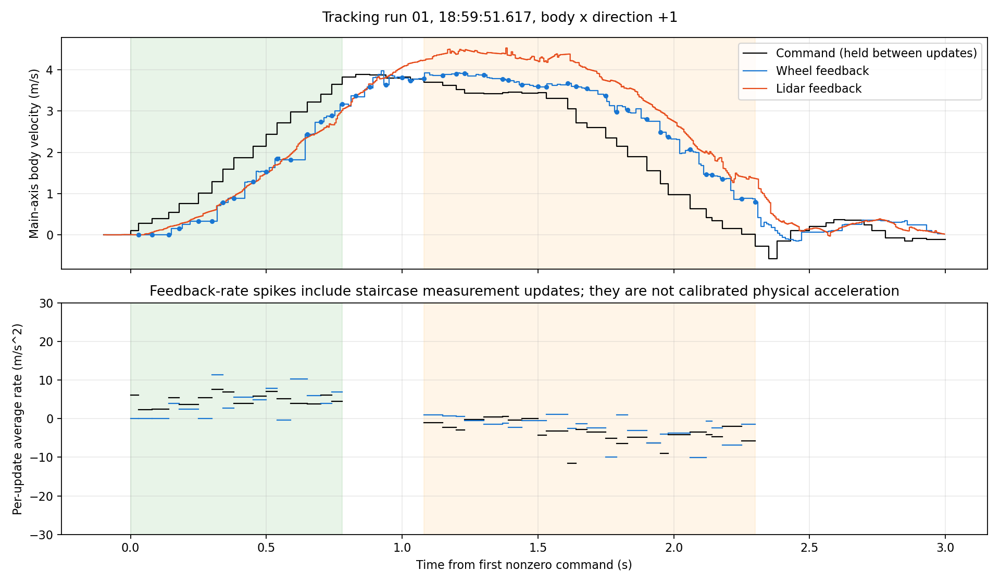
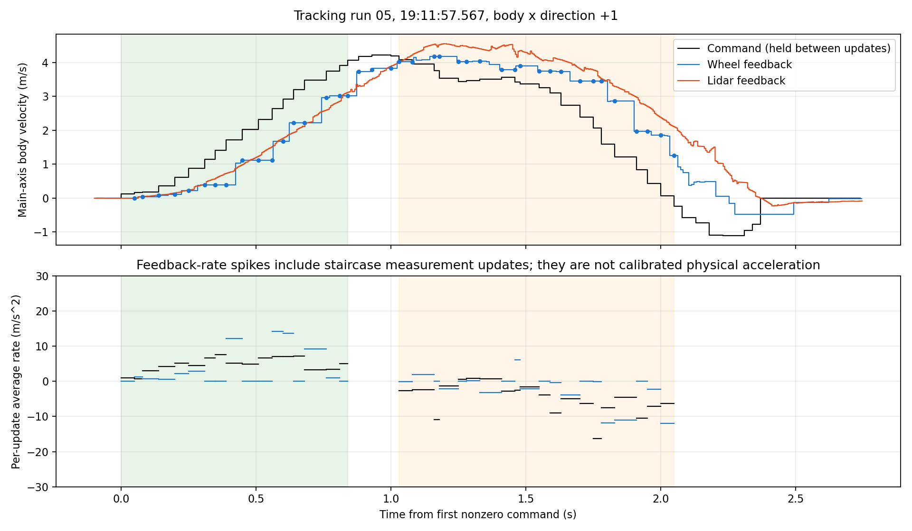
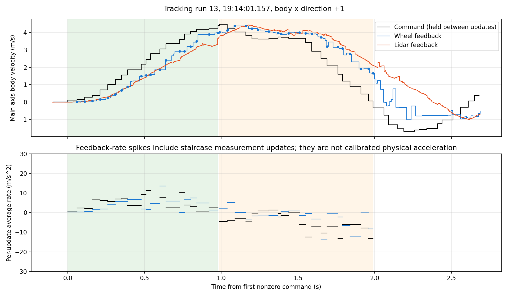

# 相邻控制指令与轮速响应分析

数据来源：`wheel_lidar_compare_20260929_185534`，2026-09-29。前4段为手动运动，下面重新编号的1～13次为寻迹运行。

## 统计定义

- 使用 rosbag 在电脑上的消息接收时间，全部数据按真实时间比较，不对轮速或雷达人为平移。
- `/cmd_chassis` 每10 ms重发；这里以其 vx/vy/vw 数值发生变化的时刻定义一次新指令，更新间隔中位数约50 ms。
- 每次往返的主运动轴为车体系x；负向往返统一乘以-1，因此下表的加速为正，制动为负。逐帧JSON仍保留原始vx、vy和其差分。
- 加速段截止于指令首次达到该次主向峰值的95%；减速段从最后达到95%峰值起，截止于首次零速或反向指令。中间为峰值附近段。末尾零速/反向指令的跨零增量计入制动统计，后续反向纠偏不计入。
- 对区间 `[t_k,t_{k+1})`，目标是该区间实际保持的 `u_k`。比较用的轮速为两端已经收到的最新反馈；下一帧到来之后的样本不用于判断上一帧是否跟上。
- 相邻指令差 `Δu=u_(k+1)-u_k`；同区间轮速差 `Δv=v(t_(k+1)^-)-v(t_k)`。`Δu/Δt` 是指令序列的等效变化率，并非保持命令区间内的瞬时物理加速度。
- 段平均变化率采用 `sum(Δv)/sum(Δt)`，不能把阶梯状反馈的逐帧变化率中位数当成底盘加速度。
- 达标判定：下一帧发出前的主向反馈速度落在上一帧目标的±0.10 m/s内。此项只统计目标≥0.30 m/s的区间，以免把静止误判为跟上很小的起步目标。
- 起步判定：连续3个反馈样本主向速度>0.02 m/s，记第一个样本的时间；同时计算0.05 m/s阈值以核对敏感性。轮速观测间隔约10 ms，雷达约5 ms。这是反馈首次显示运动的时间，不能直接证明电机何时收到命令或车体何时开始移动。
- 4个模长超过6 m/s的明显轮速异常样本所涉及区间不参与统计；未对其它原始反馈做滤波。

## 合并统计

| 阶段 | 区间数 | 平均指令变化 m/s/帧 | 平均轮速变化 m/s/帧 | 指令平均变化率 m/s² | 轮速平均变化率 m/s² | 下一帧前达标 |
|---|---:|---:|---:|---:|---:|---:|
| 加速 | 207 | 0.251 | 0.206 | 5.05 | 4.13 | 0/184（0.0%） |
| 减速 | 240 | -0.237 | -0.140 | -4.73 | -2.80 | 7/227（3.1%） |

这些是所选加减速时间段内的反馈速度变化率；滞后、旧轮速样本、编码器量化和逆解误差均包含在内，不等于底盘最大物理加减速能力。

## 各次运行起步

| 寻迹次数 | 时间 | 方向 | 第一目标 m/s | 下一帧间隔 ms | 下一帧前轮速 m/s | 轮速起步 ms（0.02/0.05阈值） | 雷达起步 ms（0.02/0.05阈值） |
|---|---|---|---:|---:|---:|---:|---:|
| 1 | 18:59:51.617 | +x | 0.096 | 30.0 | 0.000 | 149.9/149.9 | 56.7/76.8 |
| 2 | 19:00:05.067 | -x | 0.292 | 50.1 | -0.000 | 90.1/90.1 | 76.7/86.8 |
| 3 | 19:05:08.897 | +x | 0.111 | 70.4 | 0.011 | 178.1/178.1 | 52.0/82.1 |
| 4 | 19:05:36.987 | -x | 0.206 | 10.0 | -0.000 | 47.8/138.1 | 36.7/51.7 |
| 5 | 19:11:57.567 | +x | 0.119 | 49.4 | 0.000 | 63.2/133.5 | 61.0/86.1 |
| 6 | 19:12:07.757 | -x | 0.139 | 40.1 | -0.000 | 74.7/122.9 | 52.0/66.9 |
| 7 | 19:12:24.317 | +x | 0.297 | 59.7 | 0.000 | 81.5/81.5 | 66.4/76.4 |
| 8 | 19:12:31.397 | -x | 0.368 | 50.0 | -0.000 | 62.0/62.0 | 41.7/46.7 |
| 9 | 19:12:37.967 | +x | 0.180 | 60.2 | 0.000 | 83.2/121.7 | 71.7/71.7 |
| 10 | 19:13:04.167 | -x | 0.151 | 59.9 | -0.000 | 71.4/149.6 | 77.1/106.8 |
| 11 | 19:13:15.407 | +x | 0.146 | 40.3 | 0.000 | 81.1/190.5 | 41.9/76.9 |
| 12 | 19:13:30.317 | -x | 0.113 | 39.5 | -0.000 | 69.5/109.4 | 51.4/81.3 |
| 13 | 19:14:01.157 | +x | 0.113 | 60.2 | 0.019 | 88.1/138.0 | 101.8/131.8 |

## 各次运行阶段平均速度变化率

| 次数 | 加速指令 | 加速轮速 | 加速差值 | 减速指令 | 减速轮速 | 减速绝对值差 |
|---|---:|---:|---:|---:|---:|---:|
| 1 | 4.78 | 4.06 | 0.72 | -3.26 | -2.45 | 0.81 |
| 2 | 3.92 | 4.27 | -0.35 | -3.61 | -2.81 | 0.81 |
| 3 | 4.76 | 2.32 | 2.45 | -5.07 | -3.49 | 1.58 |
| 4 | 4.90 | 4.17 | 0.73 | -4.71 | -2.41 | 2.31 |
| 5 | 4.70 | 3.59 | 1.11 | -4.24 | -2.71 | 1.54 |
| 6 | 5.36 | 4.28 | 1.08 | -5.11 | -2.20 | 2.91 |
| 7 | 5.54 | 4.51 | 1.03 | -5.08 | -3.42 | 1.65 |
| 8 | 6.30 | 5.10 | 1.20 | -6.32 | -3.61 | 2.72 |
| 9 | 6.28 | 4.66 | 1.62 | -6.60 | -3.38 | 3.22 |
| 10 | 5.51 | 4.79 | 0.72 | -5.15 | -2.39 | 2.75 |
| 11 | 5.29 | 4.11 | 1.18 | -4.92 | -2.60 | 2.32 |
| 12 | 4.82 | 4.32 | 0.49 | -4.32 | -2.95 | 1.37 |
| 13 | 4.38 | 4.05 | 0.33 | -4.80 | -2.35 | 2.45 |

单位全部为m/s²；加速差值为指令减反馈，负值表示该段反馈净增速比指令净增速大。

## 逐帧例子：寻迹第13次

下面每行表示新指令发出后，到下一帧新指令发出前的区间。

| 阶段 | 起始s | 间隔ms | 区间目标u_k | 下一目标 | Δu | 轮速开始 | 轮速结束 | Δv | 结束目标误差u_k-v_end |
|---|---:|---:|---:|---:|---:|---:|---:|---:|---:|
| 加速 | 0.000 | 60.2 | 0.113 | 0.159 | +0.045 | 0.000 | 0.019 | +0.019 | +0.094 |
| 加速 | 0.060 | 50.0 | 0.159 | 0.275 | +0.116 | 0.019 | 0.035 | +0.016 | +0.124 |
| 加速 | 0.110 | 50.0 | 0.275 | 0.380 | +0.105 | 0.035 | 0.065 | +0.030 | +0.210 |
| 加速 | 0.160 | 49.7 | 0.380 | 0.700 | +0.320 | 0.065 | 0.148 | +0.083 | +0.232 |
| 加速 | 0.210 | 50.3 | 0.700 | 1.008 | +0.308 | 0.148 | 0.237 | +0.088 | +0.463 |
| 加速 | 0.260 | 50.1 | 1.008 | 1.289 | +0.281 | 0.237 | 0.448 | +0.211 | +0.560 |
| 加速 | 0.310 | 39.7 | 1.289 | 1.562 | +0.273 | 0.448 | 0.668 | +0.220 | +0.621 |
| 加速 | 0.350 | 40.4 | 1.562 | 1.856 | +0.294 | 0.668 | 0.890 | +0.222 | +0.672 |
| 加速 | 0.390 | 90.0 | 1.856 | 2.175 | +0.320 | 0.890 | 1.491 | +0.601 | +0.364 |
| 加速 | 0.480 | 29.6 | 2.175 | 2.446 | +0.270 | 1.491 | 1.545 | +0.054 | +0.630 |
| 加速 | 0.510 | 29.9 | 2.446 | 2.782 | +0.337 | 1.545 | 1.588 | +0.043 | +0.857 |
| 加速 | 0.540 | 60.2 | 2.782 | 3.063 | +0.281 | 1.588 | 1.863 | +0.275 | +0.919 |
| 加速 | 0.600 | 39.8 | 3.063 | 3.364 | +0.301 | 1.863 | 2.401 | +0.537 | +0.662 |
| 加速 | 0.640 | 90.4 | 3.364 | 3.611 | +0.247 | 2.401 | 2.929 | +0.528 | +0.435 |
| 加速 | 0.730 | 29.9 | 3.611 | 3.913 | +0.303 | 2.929 | 2.928 | -0.001 | +0.682 |
| 加速 | 0.760 | 39.7 | 3.913 | 4.066 | +0.152 | 2.928 | 3.198 | +0.270 | +0.715 |
| 加速 | 0.800 | 40.6 | 4.066 | 4.188 | +0.122 | 3.198 | 3.501 | +0.303 | +0.565 |
| 加速 | 0.840 | 79.6 | 4.188 | 4.241 | +0.054 | 3.501 | 3.889 | +0.389 | +0.298 |
| 加速 | 0.920 | 59.9 | 4.241 | 4.407 | +0.166 | 3.889 | 3.966 | +0.077 | +0.275 |
| 减速 | 0.990 | 50.0 | 4.470 | 4.240 | -0.231 | 4.015 | 4.124 | +0.110 | +0.346 |
| 减速 | 1.040 | 50.1 | 4.240 | 4.029 | -0.211 | 4.124 | 4.379 | +0.255 | -0.139 |
| 减速 | 1.090 | 70.2 | 4.029 | 3.820 | -0.209 | 4.379 | 4.377 | -0.002 | -0.348 |
| 减速 | 1.160 | 39.7 | 3.820 | 3.643 | -0.177 | 4.377 | 4.228 | -0.149 | -0.407 |
| 减速 | 1.200 | 40.1 | 3.643 | 3.616 | -0.027 | 4.228 | 4.160 | -0.067 | -0.517 |
| 减速 | 1.240 | 70.2 | 3.616 | 3.672 | +0.056 | 4.160 | 4.065 | -0.096 | -0.449 |
| 减速 | 1.310 | 59.7 | 3.672 | 3.745 | +0.074 | 4.065 | 3.976 | -0.089 | -0.305 |
| 减速 | 1.370 | 19.9 | 3.745 | 3.736 | -0.009 | 3.976 | 3.931 | -0.045 | -0.186 |
| 减速 | 1.390 | 50.5 | 3.736 | 3.661 | -0.075 | 3.931 | 3.952 | +0.021 | -0.216 |
| 减速 | 1.440 | 69.8 | 3.661 | 3.672 | +0.011 | 3.952 | 4.007 | +0.055 | -0.346 |
| 减速 | 1.510 | 39.8 | 3.672 | 3.427 | -0.245 | 4.007 | 3.950 | -0.057 | -0.278 |
| 减速 | 1.550 | 40.0 | 3.427 | 2.928 | -0.499 | 3.950 | 3.931 | -0.020 | -0.504 |
| 减速 | 1.590 | 60.1 | 2.928 | 2.505 | -0.423 | 3.931 | 3.733 | -0.198 | -0.805 |
| 减速 | 1.650 | 40.1 | 2.505 | 2.086 | -0.419 | 3.733 | 3.189 | -0.543 | -0.684 |
| 减速 | 1.690 | 70.1 | 2.086 | 1.593 | -0.493 | 3.189 | 3.164 | -0.025 | -1.078 |
| 减速 | 1.760 | 29.7 | 1.593 | 1.198 | -0.395 | 3.164 | 3.097 | -0.067 | -1.505 |
| 减速 | 1.790 | 50.1 | 1.198 | 0.892 | -0.306 | 3.097 | 2.771 | -0.327 | -1.572 |
| 减速 | 1.840 | 70.2 | 0.892 | 0.464 | -0.429 | 2.771 | 1.904 | -0.866 | -1.012 |
| 减速 | 1.910 | 49.7 | 0.464 | 0.071 | -0.393 | 1.904 | 1.914 | +0.009 | -1.450 |
| 减速 | 1.960 | 30.0 | 0.071 | -0.328 | -0.398 | 1.914 | 1.665 | -0.249 | -1.595 |

## 曲线

完整逐帧数据与统计定义保存在 `frame_response.json`；分析脚本为同目录 `analyze_frame_response.py`。
